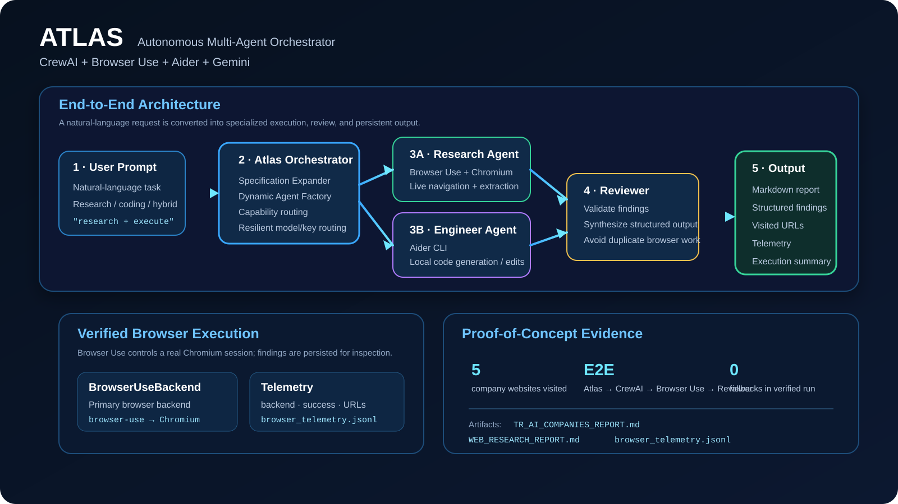
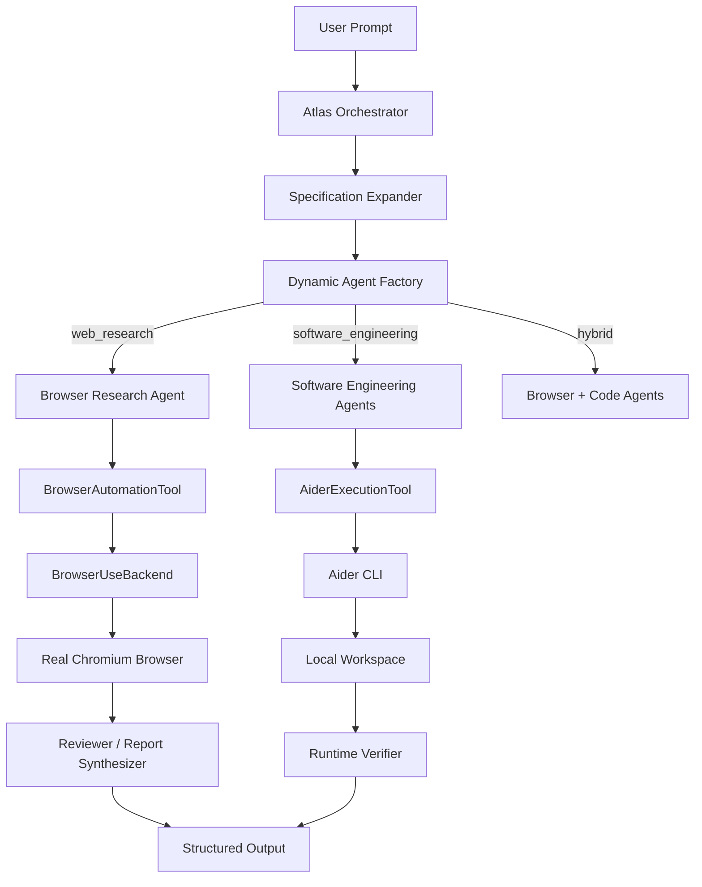

# Atlas — Multi-Agent Web Research & Browser Automation System

Atlas is a Python-based autonomous multi-agent orchestration system that combines **CrewAI**, **Browser Use**, **Playwright**, **Aider**, and **Google Gemini**.

The project is designed around a simple idea:

> Give an AI agent a real task, let Atlas decompose the task into specialized work, give each specialist the capability it needs, execute the work, and produce a structured result that can be inspected and verified.

Atlas currently supports two main capability paths:

- **Web research / browser automation** — agents can use a real Chromium browser to navigate live websites, inspect pages, extract information, and produce structured reports.
- **Software engineering** — agents can use Aider to create or modify code inside a local workspace.

The repository also contains a verified end-to-end web research proof of concept that exercises the full path:

**Atlas → CrewAI → Browser Research Agent → Browser Use → Chromium → Reviewer → Markdown Report**

---

## Visual overview

The following diagram shows the main Atlas execution path, from a natural-language request to specialized agents, browser/code execution, review, and persistent output.



### Verified execution evidence

The repository contains a visual reconstruction of the recorded successful Browser Use run and a preview of the generated report.

> These two visuals are **evidence panels reconstructed from the committed execution log/report**. They are not screenshots of the user's desktop. A real Chromium screenshot should be captured locally from the `--show-browser` command below and added to `docs/demo/` when available.


The underlying artifacts are also committed directly:

- [TR_AI_COMPANIES_REPORT.md](workspace_research/TR_AI_COMPANIES_REPORT.md)
- [WEB_RESEARCH_REPORT.md](workspace_research/WEB_RESEARCH_REPORT.md)
- [browser_telemetry.jsonl](workspace_research/browser_telemetry.jsonl)

To capture the real browser window locally:

```bash
python -X utf8 examples/web_research_demo.py --show-browser
```

Recommended README capture sequence:

```text
1. Start the demo with --show-browser.
2. Capture one image while the browser is navigating/searching.
3. Capture one image when the final company/research page is open.
4. Save them under docs/demo/.
5. Embed them below the evidence panels.
```

---

## What problem does Atlas solve?

A normal LLM can generate an answer, but it does not automatically have a reliable execution layer.

Atlas adds that execution layer.

For example, a user can request:

> "Research Turkish AI companies, visit their official websites, extract their main products and contact information, and return the findings as a comparison table."

Atlas can turn that request into a workflow in which:

1. The task is classified.
2. A technical specification is generated.
3. A specialized agent is created for the task.
4. The required capability is attached to that agent.
5. A real browser session is used to inspect live web pages.
6. The raw browser findings are passed to a reviewer.
7. The reviewer produces the final structured report.
8. Browser execution telemetry is written to disk.

The same orchestration layer can route a software-development task to Aider instead of the browser capability.

---

## Core capabilities

### 1. Dynamic multi-agent orchestration

Atlas does not rely only on one hard-coded agent.

The runtime contains:

- a **Specification Expander** that classifies and expands the user's request,
- a **Dynamic Agent Factory** that creates the appropriate specialist team,
- task-specific capabilities such as browser automation or code execution,
- a **Reviewer / Synthesizer** that validates and restructures the result.

The current execution model is intentionally task-dependent:

- **Web research:** one browser research specialist + one reviewer.
- **Software engineering:** up to five specialist agents + one reviewer.
- **Hybrid tasks:** browser and code capabilities can be assigned together when required by the generated blueprint.

This keeps web research focused while preserving the multi-agent architecture for more complex software tasks.

---

### 2. Real browser automation with Browser Use

The primary browser capability is implemented in:

`tools/browser_tool.py`

The architecture exposes a common `BrowserAutomationTool` interface and keeps the browser engine behind a backend abstraction.

Current backends:

- `BrowserUseBackend` — primary backend.
- `PlaywrightSmartBackend` — fallback backend.
- `http-dom-fallback` — lightweight fallback inside the Playwright path when browser startup is unavailable.

The primary flow uses **Browser Use + Chromium** so the agent can operate on live web pages rather than relying only on direct HTTP requests.

The browser result model records:

- task,
- backend used,
- visited URLs,
- extracted content,
- structured data,
- elapsed time,
- error information when applicable.

---

### 3. Resilient Gemini model / API-key routing

Atlas uses `tools/key_manager.py` to handle Gemini credentials and model fallback.

The router can load credentials from:

```text
GEMINI_USER_A_KEY
GEMINI_USER_B_KEY
GEMINI_USER_C_KEY
GEMINI_USER_D_KEY
GEMINI_USER_E_KEY
GEMINI_USER_F_KEY
GEMINI_API_KEYS
GEMINI_API_KEY
```

The runtime chooses models from separate cascades for architect/reviewer work and worker/browser work.

When a request encounters transient conditions such as:

- HTTP 429 / resource exhaustion,
- HTTP 503 / service unavailable,
- HTTP 504,
- model availability errors,
- rate-limit or quota signals,

the router marks the affected model/key combination and advances through the available cascade.

For Browser Use specifically, Atlas wraps the Browser Use Gemini client so model/key rotation can happen during the browser agent's execution instead of only between high-level tasks.

This is important because a long browser task may perform many model calls.

---

### 4. Local software engineering with Aider

The second major capability is implemented in:

`tools/aider_tool.py`

Aider is exposed to CrewAI agents through `AiderExecutionTool`.

A software-engineering task can therefore follow this pattern:

```text
User request
    ↓
Atlas task analysis
    ↓
Dynamic specialist agents
    ↓
Aider Code Execution Tool
    ↓
Local project files
    ↓
Verification / review
```

The tool can:

- create files,
- edit existing files,
- run Aider inside a target workspace,
- preserve the workspace as a Git repository,
- detect common rate-limit / service errors,
- retry through the Gemini model/key router,
- return a concise execution summary.

---

## Architecture

### High-level system



### Web research execution path

```text
User prompt
   │
   ▼
SpecificationExpander
   │
   ├── Detect task type: web_research
   ├── Expand research requirements
   └── Define edge-case rules
   │
   ▼
DynamicAgentFactory
   │
   ├── Browser Research & Web Extraction Agent
   │       └── BrowserAutomationTool
   │               └── BrowserUseBackend
   │                       └── Browser Use Agent
   │                               └── Chromium
   │
   └── Lead Research Reviewer & Structured Report Synthesizer
   │
   ▼
Markdown report + browser telemetry
```

### Software engineering execution path

```text
User prompt
   │
   ▼
SpecificationExpander
   │
   ▼
DynamicAgentFactory
   │
   ├── Core / Data Specialist
   ├── Business Logic Specialist
   ├── API / Interface Specialist
   ├── QA / Test Specialist
   └── DevOps / Documentation Specialist
   │
   ▼
AiderExecutionTool
   │
   ▼
Local Git workspace
   │
   ▼
Lead Code Reviewer / Systems Integrator
   │
   ▼
Verified implementation summary
```

---

## Repository structure

```text
Atlas/
├── agents.py
├── crew.py
├── dynamic_factory.py
├── spec_expander.py
├── critic_verifier.py
├── main.py
├── requirements.txt
├── .env.example
├── tools/
│   ├── __init__.py
│   ├── browser_tool.py
│   ├── aider_tool.py
│   └── key_manager.py
├── examples/
│   └── web_research_demo.py
└── workspace_research/
    ├── TR_AI_COMPANIES_REPORT.md
    ├── WEB_RESEARCH_REPORT.md
    └── browser_telemetry.jsonl
```

### Important modules

| Module | Responsibility |
|---|---|
| `main.py` | Unified CLI entry point |
| `crew.py` | Main orchestration and execution loop |
| `dynamic_factory.py` | Runtime creation of agents, tasks, and capabilities |
| `spec_expander.py` | Task-mode detection and technical specification expansion |
| `critic_verifier.py` | Syntax, entrypoint, and unit-test verification |
| `tools/browser_tool.py` | Browser capability abstraction and Browser Use / Playwright execution |
| `tools/aider_tool.py` | Local software-engineering execution through Aider |
| `tools/key_manager.py` | Gemini key pool, model cascades, cooldowns, and fallback routing |
| `examples/web_research_demo.py` | Demonstration entry point for the internship PoC |

---

# Quick start

## 1. Requirements

Recommended environment:

- Python **3.11+**
- Git
- Chromium / Playwright browser binaries
- Google AI Studio Gemini API key(s)

The current repository has been exercised with **Python 3.12** and **browser-use 0.11.13**.

---

## 2. Clone and install

### Windows PowerShell

```powershell
git clone https://github.com/Piardian/Atlas.git
cd Atlas

python -m venv .venv
.\.venv\Scripts\Activate.ps1

pip install -r requirements.txt
playwright install chromium

Copy-Item .env.example .env
```

### macOS / Linux

```bash
git clone https://github.com/Piardian/Atlas.git
cd Atlas

python3 -m venv .venv
source .venv/bin/activate

pip install -r requirements.txt
playwright install chromium

cp .env.example .env
```

---

## 3. Configure Gemini

Add at least one valid Gemini key to `.env`.

For better resilience, configure multiple keys:

```dotenv
GEMINI_USER_A_KEY=your_key_a
GEMINI_USER_B_KEY=your_key_b
GEMINI_USER_C_KEY=your_key_c
GEMINI_USER_D_KEY=your_key_d
```

The router also accepts a comma-separated pool:

```dotenv
GEMINI_API_KEYS=key_a,key_b,key_c,key_d
```

A single key is also supported:

```dotenv
GEMINI_API_KEY=your_key
```

Do **not** commit `.env` or real API credentials.

---

# Running Atlas

## Web research demo

The repository includes an internship-oriented proof of concept for autonomous web research.

### Full multi-agent execution

```bash
python -X utf8 examples/web_research_demo.py --show-browser
```

This runs the full chain:

```text
Atlas
  → CrewAI
  → Browser Research Agent
  → BrowserAutomationTool
  → BrowserUseBackend
  → Browser Use
  → Chromium
  → Reviewer
  → Markdown report
```

### Headless execution

```bash
python -X utf8 examples/web_research_demo.py
```

### Direct browser capability test

```bash
python -X utf8 examples/web_research_demo.py --direct-tool --show-browser
```

The direct mode is useful when debugging the browser layer independently from CrewAI orchestration.

### Main CLI equivalent

```bash
python -X utf8 main.py --browser-demo --show-browser
```

---

## Custom web research

You can provide any natural-language research request:

```bash
python -X utf8 main.py --show-browser --prompt "Türkiye'deki yapay zeka şirketlerini araştır. Resmi web sitelerini ziyaret et, ana ürünlerini ve iletişim bilgilerini çıkar, sonuçları tablo halinde raporla." --workspace ./workspace_research
```

The generated task is classified as web research and the browser capability is attached automatically.

---

## Software engineering task

Atlas can also route a development request to Aider-backed agents:

```bash
python -X utf8 main.py --prompt "FastAPI ile JWT tabanlı bir görev yönetim servisi geliştir. Testleri de ekle." --workspace ./workspace_api
```

A typical flow is:

```text
Task analysis
   ↓
Agent blueprint
   ↓
Specialist agents
   ↓
Aider
   ↓
Local code changes
   ↓
Reviewer / verification
```

---

# Browser capability in detail

The browser layer is intentionally isolated behind an interface.

`BrowserAutomationTool` provides the CrewAI-facing API, while individual browser engines implement `BaseBrowserBackend`.

This gives Atlas an extension point for future browser providers without changing the agent-facing interface.

Current design:

```text
CrewAI Agent
    │
    ▼
BrowserAutomationTool
    │
    ├── preferred_backend = browser-use
    │       ↓
    │   BrowserUseBackend
    │       ↓
    │   browser-use Agent
    │       ↓
    │   Chromium
    │
    └── fallback
            ↓
        PlaywrightSmartBackend
            ↓
        Playwright Chromium / HTTP DOM fallback
```

The browser tool can receive:

```text
task       : natural-language browser task
start_url  : optional initial URL
headless   : visible or headless browser mode
```

Example conceptual task:

```text
Visit the official website of a company.
Find its AI products.
Open the contact page if available.
Extract publicly visible contact information.
Return the findings with the exact URLs visited.
```

---

# Browser telemetry

Every browser execution can append a JSON Lines record to:

`workspace_research/browser_telemetry.jsonl`

Example:

```json
{
  "timestamp": "2026-09-28T18:58:00Z",
  "agent_role": "Browser Research & Web Extraction Agent",
  "backend_used": "browser-use (gemini-3.5-flash-lite)",
  "success": true,
  "visited_urls": [
    "https://example.com/"
  ],
  "elapsed_seconds": 64.2,
  "fallback_triggered": false
}
```

The telemetry exists for observability rather than only for debugging.

It lets you inspect:

- which browser backend actually ran,
- whether fallback occurred,
- which URLs were visited,
- how long the execution took,
- whether the task was marked successful.

---

# Verified proof of concept

The repository contains the artifacts from a completed end-to-end Browser Use run.

The verified flow used the Browser Use backend directly and generated reports from real website visits.

Example artifacts:

```text
workspace_research/
├── TR_AI_COMPANIES_REPORT.md
├── WEB_RESEARCH_REPORT.md
└── browser_telemetry.jsonl
```

The recorded proof includes a successful Browser Use execution with `fallback_triggered: false`.

This matters because the project is not only a collection of integrations: the browser path has been exercised end-to-end and produced persistent output artifacts.

---

# Reliability and fallback design

Atlas treats external model services as failure-prone dependencies.

There are two levels of fallback:

### High-level task fallback

If an architect, worker, or reviewer model fails due to a recoverable service condition, the router can move to another model/key combination.

### Browser-step fallback

Browser Use may perform many LLM calls during a single browser session.

To handle that, Atlas wraps the Browser Use Gemini client with a rotating adapter.

Conceptually:

```text
Browser Use step
      ↓
Current Gemini model + key
      ↓
Success ───────────────► continue browser session
      │
      └─ 429 / 503 / 504 / related failure
              ↓
       mark model/key
              ↓
       select next pair
              ↓
       continue browser session
```

The goal is to avoid throwing away a partially completed browser session simply because one model/key request temporarily failed.

---

# Verification

Atlas includes a lightweight runtime verification layer in:

`critic_verifier.py`

Current checks include:

1. Python syntax compilation.
2. Entrypoint validation when a `run.py` file is present.
3. Unit-test discovery with Python's `unittest`.
4. A self-healing path that can invoke Aider for critical syntax / entrypoint fixes.

Run the project's tests with:

```bash
python -m unittest discover tests
```

If a project workspace generated by an engineering task contains tests, the verifier can execute the same discovery pattern against that workspace.

---

# Design principles

Atlas is built around several practical principles.

### Capability abstraction

Agents should request capabilities through stable interfaces instead of knowing how every backend works.

For example:

```text
Agent
  → BrowserAutomationTool
      → BrowserUseBackend
      → PlaywrightSmartBackend
```

The same pattern is used for Aider.

### Separation of planning and execution

The architecture separates:

- task understanding,
- agent creation,
- capability execution,
- result review,
- verification.

That makes failures easier to isolate.

### Observable execution

Browser tasks produce telemetry instead of returning only a final natural-language answer.

### Graceful degradation

External APIs can fail. Atlas therefore treats rate limits and temporary service failures as expected operational conditions.

### No silent failure

The browser path records execution state and error information rather than silently ignoring failures.

---

# Security considerations

Atlas can interact with two powerful environments:

1. **The live web**, through browser automation.
2. **The local filesystem**, through Aider.

For that reason, run Atlas with a workspace appropriate for the task.

Recommended practices:

- use a dedicated virtual environment,
- keep API keys only in environment variables,
- do not commit `.env`,
- do not point Aider at sensitive directories,
- review generated code before executing it in production,
- use headless mode when visual interaction is unnecessary,
- avoid giving the browser agent tasks involving credentials, banking, or other sensitive accounts unless the environment is explicitly isolated for that purpose.

Atlas is an orchestration framework, not a security sandbox.

---

# Limitations

Atlas currently has some deliberate boundaries.

### External model dependency

The system relies on Gemini availability, quotas, and API behavior. The router reduces the impact of transient failures but cannot guarantee service availability.

### Website variability

Browser automation depends on the structure and behavior of the target site. JavaScript-heavy pages, anti-bot systems, authentication walls, CAPTCHAs, dynamic navigation, or unstable layouts can still affect extraction quality.

### Research quality

A browser visit is evidence of page access, not a guarantee that every extracted fact is correct. The reviewer layer improves structure and consistency, but research outputs should still be checked for high-stakes use.

### Local execution permissions

Aider is intentionally capable of modifying files in the target workspace. That power should be treated as an operational boundary.

### Resource usage

Browser Use + Chromium is significantly more expensive in time and compute than a simple HTTP request.

---

# Configuration reference

The main runtime reads these environment values.

| Variable | Purpose |
|---|---|
| `GEMINI_API_KEY` | Single Gemini API key |
| `GEMINI_USER_A_KEY` ... `GEMINI_USER_F_KEY` | Individual keys for the pool |
| `GEMINI_API_KEYS` | Comma-separated key pool |
| `PLANNER_MODEL` | Baseline planner model for static agent configuration |
| `CODER_MODEL` | Baseline coder model for static agent configuration |
| `REVIEWER_MODEL` | Baseline reviewer model for static agent configuration |
| `TARGET_WORKSPACE` | Default workspace used by the CLI |

The dynamic runtime's model cascades are defined in:

`tools/key_manager.py`

This is intentional: environment variables provide configuration, while the router controls resilient runtime selection.

---

# Example use cases

Atlas is suitable for workflows such as:

### Web intelligence

```text
"Research 10 companies in a specific market.
Visit their official websites.
Extract products, locations, and contact details.
Return a structured comparison."
```

### Competitive research

```text
"Visit competitor websites and identify their publicly visible
features, pricing pages, and product categories."
```

### Documentation research

```text
"Open the official documentation pages for a technology,
collect the installation requirements and major components,
and produce a concise implementation guide."
```

### Software engineering

```text
"Build a FastAPI service with authentication, tests,
configuration management, and a CLI entry point."
```

### Hybrid workflow

```text
"Research an external API using the official documentation,
then create a Python client for the discovered endpoints
and add tests."
```

---

# Relation to the reference project family

The original project direction was inspired by several open-source AI agent patterns:

| Reference concept | Atlas implementation |
|---|---|
| Autonomous coding agent | Aider-backed software-engineering capability |
| Multi-agent orchestration | CrewAI + Dynamic Agent Factory |
| Browser automation agent | Browser Use + Chromium |
| Structured review | Reviewer / Synthesizer stage |
| Runtime resilience | Gemini key/model cascading |

The goal was not to clone any one reference project. Atlas combines the ideas into one execution-oriented architecture.

---

# Why the project is structured this way

The main design trade-off is deliberate:

**Do not put every capability into every agent.**

A research agent should have browser tools.

A software-engineering agent should have code-execution tools.

A reviewer should generally receive the outputs it needs without unnecessarily opening another browser session.

This reduces unnecessary tool calls, keeps responsibilities explicit, and makes the execution trace easier to understand.

---

# Development notes

Useful files while developing:

```text
README.md
crew.py
dynamic_factory.py
spec_expander.py
critic_verifier.py
tools/browser_tool.py
tools/aider_tool.py
tools/key_manager.py
examples/web_research_demo.py
```

When changing the browser layer, a practical verification sequence is:

```bash
# 1. Install dependencies
pip install -r requirements.txt

# 2. Ensure Chromium is available
playwright install chromium

# 3. Test the direct browser capability
python -X utf8 examples/web_research_demo.py --direct-tool --show-browser

# 4. Test the full multi-agent flow
python -X utf8 examples/web_research_demo.py --show-browser

# 5. Inspect telemetry
# workspace_research/browser_telemetry.jsonl

# 6. Inspect generated reports
# workspace_research/TR_AI_COMPANIES_REPORT.md
# workspace_research/WEB_RESEARCH_REPORT.md
```

---

# Technology stack

| Component | Role |
|---|---|
| Python | Main implementation language |
| CrewAI | Multi-agent orchestration |
| Browser Use | Autonomous browser interaction |
| Chromium / Playwright | Browser runtime |
| Aider | Local software-engineering execution |
| Google Gemini | Planning, agent reasoning, review, and browser-step LLM calls |
| LiteLLM | Model invocation layer used by Atlas |
| Pydantic | Tool input / data models |
| Rich | CLI presentation |
| python-dotenv | Environment configuration |

---

# License

MIT License.

---

# Project status

Atlas currently represents a working prototype / proof of concept rather than a production-hardened enterprise platform.

The main browser-automation path, model/key fallback path, dynamic agent creation path, review stage, and end-to-end report generation have been implemented and exercised.

The next engineering priorities should be reliability, test coverage, portability, and controlled deployment rather than adding unrelated features.
